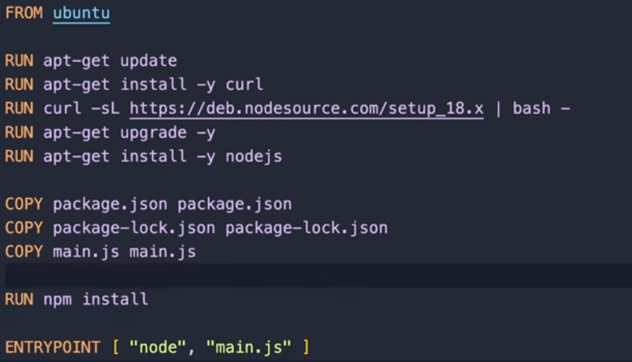

###  What is Docker 
- Docker is a platform that utilizes containerization technology to create, deploy, and manage applications in isolated and portable environments.
- Docker is a tool that simplifies the process of packaging and deploying applications, making them more portable and efficient across different computing environments.


### What is the main difference between an Image and a Container ? 
- The main difference between an image and a container is that an image is a static, lightweight, and portable file that includes the code, runtime, libraries, and environment variables needed to run an application, whereas a container is a live, running instance of that image with its own memory and processing space. In other words, an image is a template for a container, while a container is a runtime instance of an image.
### What is Docker daemon?
- The Docker daemon is a background service that manages Docker objects, such as images, containers, networks, and volumes. It acts as the intermediary between the Docker client and the Docker registry. The daemon is responsible for building, running, and distributing Docker containers. It listens for Docker API requests and performs the tasks necessary to manage these requests. It's essentially the core of the Docker engine, enabling communication between the Docker client and the Docker server.
### How to download a specific image 
```
$ docker pull image_name
```
Download a ubuntu

```
$ docker pull ubuntu
```
### Some Commands related to Docker Daemon
- To know the status of the docker daemon 
```
$ systemctl status docker
```
- To start daemon
```
$ sudo systemctl start docker
```
- To stop daemon
```
$ sudo systemctl stop docker
```
### Some Commands related to Docker 
- Check docker version
```
$ docker --version
```
- Show all docker images present in local system 
```
$ docker images 
```
- Show Running containers 
```
$ docker container ls
```
- Show all container 
```
$ docker container ls -a
```
- Docker Run 
1. To create a new docker container 
2. This just creates the container not start the container 
```
$ docker run images_name
```
- To start and stop the container
```
$ docker start/stop docker_name 
```
```
$ docker start/stop docker_id
```
- Run the command extremely 
```
$ docker exec docker_name 'command'
```
- To connect docker 
```
docker exec -it docker_name bash
```
### Explain this command $ docker run -it ubuntu 
- The command "docker run -it ubuntu" is used to run a new Docker container based on the Ubuntu operating system image in an interactive mode, which allows you to interact with the container's shell.
- Here's what each part of the command does:
    - "docker run" is the command used to create and start a new container.
    - "-it" is a combination of two flags. The "-i" flag stands for interactive, which keeps the standard input open, and the "-t" flag allocates a pseudo-TTY that allows you to interact with the container's shell.
    - "ubuntu" is the name of the Docker image that you want to run. If the specified image is not already present on your local machine, Docker will automatically download it from the default registry (Docker Hub).
```
$ docker run -it ubuntu
```
### What is Docker Port Mapping 
Docker port mapping is a method that enables you to expose services running inside a container to the outside world by mapping specific ports on the host to ports within the container.

```
$ docker run -it -p local_system_port:docker_port image_name
```
### Docker environment variables 
- Docker environment variables are key-value pairs that can be passed to Docker containers during the container's runtime. These variables allow you to customize the behavior of the application inside the container without modifying the container image itself. Docker environment variables can be set at build time or runtime.
- **docker run command**: You can also set environment variables during container runtime by using the `**-e**`  flag with the `**docker run**`  command. For instance:
```
$ docker run -e ENV_VARIABLE_NAME=variable_value docker_iamage
```
- **Docker Compose**: If you are using Docker Compose to manage multi-container Docker applications, you can define environment variables in the `**docker-compose.yml**`  file. For example:
```
services:
myservice:
  image: myimage
  environment:
    - ENV_VARIABLE_NAME=variable_value
```
### what is Dockerfile 
- A Dockerfile is a text document that contains a set of instructions for building a Docker image. 
- It is a fundamental component in defining what goes on in the environment inside your Docker container. 
- Docker reads the Dockerfile to automate the process of building a Docker image. 
- The Dockerfile consists of various commands and arguments that specify the components and operating environment for a container.
- Here is an example of a simple Dockerfile:
```
# Use an official Python runtime as the base image
FROM python:3.9-slim

# Set the working directory in the container
WORKDIR /app

# Copy the current directory contents into the container at /app
COPY . /app

# Install any needed packages specified in requirements.txt
RUN pip install --trusted-host pypi.python.org -r requirements.txt

# Make port 80 available to the world outside this container
EXPOSE 80

# Define environment variable
ENV NAME World

# Run app.py when the container launches
CMD ["python", "app.py"]
```
In this example, the Dockerfile specifies a series of commands:

- `**FROM**` : Specifies the base image to use for the build.
- `**WORKDIR**` : Sets the working directory within the container.
- `**COPY**` : Copies files from the host machine to the container.
- `**RUN**` : Executes commands in the container's shell during the build process.
- `**EXPOSE**` : Informs Docker that the container listens on the specified network ports at runtime.
- `**ENV**` : Sets environment variables.
- `**CMD**` : Provides the default command for the container when it starts.
With a Dockerfile, you can define the entire environment needed to run an application, making it easier to reproduce the same environment across different systems.

Example Docker file 



### What Docker-compose file
- A Docker Compose file is a YAML file used to define and run multi-container Docker applications. 
- It allows you to define the services, networks, and volumes required for your application in a single file, making it easier to manage complex Docker applications. 
- Docker Compose simplifies the process of managing multiple containers by allowing you to define all the configuration settings in a single, easy-to-read file.
- A basic Docker Compose file might look like this: (docker-compse.yml)
```
version: '3'
services:
  web:
    build: .
    ports:
      - "5000:5000"
  redis:
    image: "redis:alpine"
```
In this example:

- `**version: '3'**`  specifies the version of the Compose file format.
- `**services**`  section defines the services that make up the application. In this case, it defines two services, 'web' and 'redis'.
- Under each service, you can define configurations such as `**build**`  to build an image, `**image**`  to use a pre-built image, and `**ports**`  to expose ports.
- The `**web**`  service is built from the local Dockerfile and exposes port 5000 on the host, which is mapped to port 5000 in the container.
- The `**redis**`  service uses the pre-built Redis image from the Docker Hub.
Using a Docker Compose file, you can easily define, run, and manage complex applications consisting of multiple interconnected containers. By defining the services, networks, and volumes in a single file, you can quickly spin up and manage your entire application stack with a single command.


### Docker Volume Mounting 
- Docker volume mounting is a technique used to share data between the Docker host and the containers. 
- It enables you to persist data generated by and used by Docker containers, ensuring that the data remains available even after the containers are terminated. Volume mounting facilitates the seamless sharing of files and directories between the host and the container, providing a convenient way to manage data persistence and access in Dockerized applications.


### Docker Networking
- In Docker, a network is a communication bridge that allows Docker containers to securely communicate with each other, with the host machine, and with external networks. Docker provides various network drivers, such as bridge, overlay, macvlan, and host, to facilitate different types of network communication and connectivity.Docker networks are crucial for enabling communication and data exchange between containers, allowing them to work together as a part of a distributed application. Using Docker networks, you can isolate and secure communication between containers, manage connectivity between different services, and control how containers communicate with each other and the outside world.
- Docker networks provide the following key features:
    1. **Isolation**: Each Docker network provides an isolated environment for containers, preventing interference and unauthorized access between different containers and services.
    2. **Connectivity**: Docker networks enable seamless connectivity between containers, allowing them to communicate securely and efficiently within the same network.
    3. **Integration**: Docker networks integrate with various network drivers, enabling different types of network configurations based on the requirements of the application or service.
- By utilizing Docker networks, you can effectively manage the networking aspect of your Docker containers, ensuring smooth and secure communication between different components of your application.
### Types Docker Network
1. **Bridge Network**: This is the default network in Docker, which allows containers on the same host to communicate with each other. Containers in the bridge network can be connected to the outside world via port mappings.
2. **Host Network**: When using the host network, a container shares the network namespace with the Docker host, effectively eliminating network isolation. This allows the container to directly access the host's network interfaces.
3. **Overlay Network**: Overlay networks are used in Docker Swarm mode to facilitate communication between containers running on different Docker hosts. They enable multi-host communication and are essential for creating distributed applications.
4. **Macvlan Network**: The Macvlan network allows you to assign a MAC address to each Docker container, making it appear as a physical device on the network. This is particularly useful for scenarios where each container needs to be identified as a separate physical device.
5. **None Network**: Containers connected to the none network are not attached to any networking, which means they cannot communicate with the external network or other containers.
6. **Custom Bridge Network**: Docker allows you to create custom bridge networks to control and configure the networking environment for your containers according to specific requirements.


### **Example of docker Bridge Network**
**Create a Bridge Network**:

- You can create a bridge network named `**my_bridge_network**` using the following 

```
docker network create my_bridge_network
```
**Run Containers on the Bridge Network**:

- You can run containers and connect them to the `**my_bridge_network**` network using the `**--network**` 

```
docker run -d --name container1 --network my_bridge_network image1
docker run -d --name container2 --network my_bridge_network image2
```
- This command will run two containers (`**container1**` and `**container2**`) and connect them to the `**my_bridge_network**` bridge network.

**Verify Network Connectivity**:

- You can verify that the containers are connected to the bridge network by inspecting the network:

```
docker network inspect my_bridge_network
```
- This command will display details about the `**my_bridge_network**` network, including the connected containers and their IP addresses.


### **Example of docker Host Network**
**Run Containers Using Host Network**:

- You can run a container using the host network mode using the `**--network=host**` flag as follows:

```
docker run -d --name container1 --network=host image1
```
- This command will run a container named `**container1**` using the host network, which means the container shares the network namespace with the Docker host.


**Verify Network Connectivity**:

- After running the container with the host network, you can check the network configuration by inspecting the container:

```
docker inspect container1
```
- This command will display detailed information about the container, including its networking configuration and other attributes.

- Using the host network mode in Docker allows the container to use the networking stack of the Docker host directly, without any isolation. This configuration can be beneficial when you need to allow the container to access the host's networking interfaces directly, without any network address translation (NAT). However, it is essential to consider security implications and potential port conflicts when using the host network mode.

